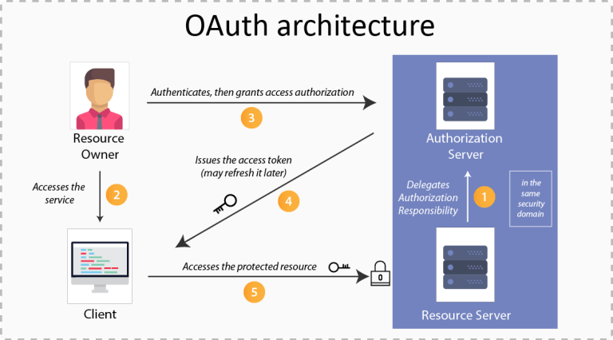

# Practicum

- [Introductie](#introductie)
- [1. Spring Boot setup](#1-spring-boot-setup)
    - [1.1 Spring Boot Initializr](#11-spring-boot-initializr)
    - [1.2 Project op GitHub](#12-project-op-gitHub)
    - [1.3 Dependency Management](#13-dependency-management)
    - [1.4 Controller](#14-Controller-aanmaken)
    - [1.5 Inversion of Control](#15-inversion-of-control)
    - [1.6 Auto-configuratie](#16-auto-configuratie)
    - [1.7 Unit test schrijven](#17-unit-test-schrijven)
    - [1.8 Endpoint test schrijven](#18-endpoint-test-schrijven)
    - [1.9 Integratietest schrijven](#19-integratietest-schrijven)
- [2. Spring Data JPA](#2-spring-data-jpa)
    - [2.1 Database opzetten](#21-database-opzetten)
    - [2.2 JPA Entiteit toevoegen](#22-jpa-entiteit-toevoegen)
    - [2.2 Database vullen](#23-database-vullen)
    - [2.2 JPA repository aanmaken en gebruiken](#24-jpa-repository-aanmaken-en-gebruiken)
- [3. Actuators](#3-actuators)
    - [3.1 Spring Boot Actuator toevoegen](#31-spring-boot-actuator-toevoegen)
    - [3.2 Uitbreiden van het aantal endpoints](#32-uitbreiden-van-het-aantal-endpoints)
- [4. Webapplicatie realiseren](#4-webapplicatie-realiseren)
    - [4.1 Maak de entiteiten aan](#41-maak-de-entiteiten-aan)
- [5. Beveiliging](#5-beveiliging)
    - [5.1 Dependency toevoegen](#51-dependency-toevoegen)
    - [5.2 In memory authenticatie](#52-in-memory-authenticatie)
    - [5.3 Security testen](#53-security-testen)
    - [5.4 Message Controller](#54-message-controller)
    - [5.5 Message Controller Integratietests](#55-messagecontrollerintegrationtests)
    - [5.6 OAuth Authenticatie](#56-oauth-authenticatie)
    - [5.7 JPA implementeren](#57-jpa-implementeren)
- [6. Aspect Oriented Programming](#6-aspect-oriented-programming)
    - [6.1 Dependency toevoegen](#61-dependency-toevoegen)
    - [6.2 Eenvoudige loging aspect maken](#62-eenvoudige-loggingaspect-aanmaken)
    - [6.3 Aspect testen](#63-aspect-testen)
    - [6.4 Eigen aspect maken](#64-eigen-aspect-maken))


# Introductie
Dit document bevat een reeks opdrachten die nauw verbonden zijn met de inhoud van een Spring Boot cursus. De opdrachten zijn ontworpen om zowel beginnende als gevorderde ontwikkelaars te begeleiden bij het ontwikkelen van webapplicaties met het Spring Boot-framework.

Spring Boot is een krachtige uitbreiding van het Spring-framework die ontwikkelaars helpt bij het snel en eenvoudig opzetten van productieklaar Java-gebaseerde toepassingen zonder uitgebreide configuratie. In deze cursus leer je werken met essentiële concepten zoals dependency injection, Spring MVC, beveiliging, databases en meer.

De opdrachten in dit document zullen je stap voor stap door het proces leiden van het bouwen van een Spring Boot-applicatie, van het opzetten van de basisstructuur tot het implementeren van geavanceerde functies. Het doel is om niet alleen theoretische kennis op te doen, maar ook praktische ervaring op te bouwen die direct toepasbaar is in echte projecten.

Of je nu bekend bent met Java en Spring, of dit je eerste kennismaking is met het framework, deze opdrachten zijn ontworpen om je zelfverzekerd te maken in het bouwen van moderne, schaalbare en onderhoudbare webapplicaties.

# 1. Spring Boot Setup

In dit hoofdstuk begeleiden de opdrachten je stap voor stap bij het opzetten van de basisstructuur van een Spring Boot-applicatie.

Je begint met het creëren van een nieuwe projectstructuur voor Spring Boot, waarbij je de benodigde dependencies toevoegt en de configuratie instelt. Daarna maak je een repository aan op GitHub waar de code van de applicatie zal worden opgeslagen.

Daarnaast zijn er opdrachten die je helpen een beter begrip te krijgen van de werking van Spring, inclusief onderwerpen zoals dependency management en auto-configuratie. Deze concepten zijn cruciaal voor het effectief ontwikkelen van applicaties met het Spring-framework.

## 1.1 Spring Boot Initializr
1. Maak een nieuw project aan in IntelliJ via File → New → Project
2. Kies voor de generator Spring Boot
3. Vul in de onderstaande gegevens en druk op Next
   
4. Selecteer de volgende dependencies en klik op Create
   
6. Je hebt, als je het correct hebt uitgevoerd, de volgende structuur
   
7. Druk op de play-knop (zie rode pijl) om de Spring Boot applicatie te starten. Als het goed is krijg je naar een paar seconden te zien dat de applicatie is gestart (zie rode ovaal).
   

## 1.2 Project op GitHub

1. Maak een nieuwe repository op GitHub met de naam _CertiCoach_. Maak hem public en voeg **GEEN** readme file toe.
2. Kopieer de commando’s onder het kopje _“...or push an existing repository from the command line”_.
3. Open een nieuwe terminal de CertiCoach directory. Voer eerst het `git commit -am "Initial setup"` command uit (om de eerste commit te doen). Voer vervolgens de gekopieerde commando’s uit om de code naar GitHub te pushen op de main branch. Dit ziet eruit als volgt:

    ```bash
    git commit -am "Initial setup" 
    git remote add origin https://github.com/{jouw GitHub accountnaam}/CertiCoach.git
    git branch -M main
    git push -u origin main
    ```
## 1.3 Dependency Management
In de vorige opdracht hebben we dependencies allemaal dependencies geselecteerd. Deze kun terugvinden in de `pom.xml`

1. Open `pom.xml` controleer of je de juiste Spring Boot versie gebruikt. Namelijk versie 3.3.4.
```xml
    <project>
    ......
      <parent>
        <groupId>org.springframework.boot</groupId>
        <artifactId>spring-boot-starter-parent</artifactId>
        <version>3.3.4</version>
        <relativePath/> <!-- lookup parent from repository -->
      </parent>
      <groupId>com.ittopdogs</groupId>
      <artifactId>CertiCoach</artifactId>
      <version>0.0.1-SNAPSHOT</version>
      <content>CertiCoach</content>
      <description>CertiCoach</description>
    ......
    </project>
```

2. Ga hierna in hetzelfde bestand en kijk of je alle dependencies die hebt aangegeven tijdens het aanmaken van het project kan terugvinden. Zoals de Spring Security en Spring Data JPA.
```xml
    <dependencies>
      <dependency>
        <groupId>org.springframework.boot</groupId>
        <artifactId>spring-boot-starter-data-rest</artifactId>
      </dependency>
      <dependency>
        <groupId>org.springframework.boot</groupId>
        <artifactId>spring-boot-starter-web</artifactId>
      </dependency>
    ......
    </dependencies>
```
3. We gaan voor nu de dependencies verwijderen die we op dit moment niet gebruiken, maar op een later moment wel. Klik hiervoor op `Edit Starters` zoals ook in de afbeelding hier beneden is aangegeven.
   
4. Pas het overzicht van dependencies aan, zodat het overeenkomt met de onderstaande afbeelding en druk op OK.
   
5. Controleer dat de dependencies niet meer bestaan in `pom.xml`.

## 1.4 Controller aanmaken
1. Maak het bestand `HelloController.java` in de package `com.ittopdogs.certicoach.controller`
```java
package com.ittopdogs.certicoach.controller;

import org.springframework.web.bind.annotation.GetMapping;
import org.springframework.web.bind.annotation.RestController;

@RestController
public class HelloController {

  @GetMapping("/hello")
  public String hello() {
    return "Hello World";
  }
}
```
2. Start de Spring Boot applicatie
3. Ga in je browser naar `localhost:8080/hello` als het goed is krijg je de response `Hello World`

## 1.5 Inversion of Control
We gaan de businesslogica van Hello World scheiden in een apart bestand om te laten zien hoe je een bean definieert. Hoewel het bij een simpele regel code wellicht overbodig lijkt, is dit een waardevolle stap om inzicht te geven in het principe van beans en de voordelen van het structureren van code. Dit bevordert een duidelijke scheiding van verantwoordelijkheden (low coupling), wat essentieel is voor het ontwikkelen van schaalbare en onderhoudbare applicaties.
1. Maak het bestand `HelloProvider.java` in de package `com.ittopdogs.certicoach.provider` en zet hierin de volgende code
```java
package com.ittopdogs.certicoach.provider;

public class HelloMessageProvider {

    public String getMessage() {
        return "Hello World!";
    }
}
```
2. Maak het bestand `HelloConfiguration.java` in de package `com.ittopdogs.certicoach.configuration` en zet hierin de volgende code
```java
package com.ittopdogs.certicoach.configuration;

import com.ittopdogs.certicoach.provider.HelloMessageProvider;
import org.springframework.context.annotation.Bean;

public class HelloConfiguration {

    @Bean
    HelloMessageProvider messageProvider() {
        return new HelloMessageProvider();
    }
}
```
3. Pas nu de `HelloController` klasse aan naar het onderstaande. In plaats van zelf "Hello World" te printen besteed je het nu uit aan de `HelloMessageProvider`.  De `HelloController` verwacht dat er automatisch een `HelloMessageProvider` bean is die gebruikt kan worden.
```java
package com.ittopdogs.certicoach.controller;

import com.ittopdogs.certicoach.provider.HelloMessageProvider;
import org.springframework.web.bind.annotation.GetMapping;
import org.springframework.web.bind.annotation.RestController;

@RestController
public class HelloController {
    private final HelloMessageProvider messageProvider;

    HelloController(HelloMessageProvider messageProvider){
        this.messageProvider = messageProvider;
    }

    @GetMapping("/hello")
    public String hello() {
        return this.messageProvider.getMessage();
    }
}
```

4. Draai de applicatie opnieuw. Je krijgt als het goed is krijg je nu de foutmelding. De Bean `HelloMessageProvider` kan niet worden gevonden.
```text
***************************
APPLICATION FAILED TO START
***************************

Description:

Parameter 0 of constructor in com.ittopdogs.certicoach.controller.HelloController required a bean of type 'com.ittopdogs.certicoach.provider.HelloMessageProvider' that could not be found.


Action:

Consider defining a bean of type 'com.ittopdogs.certicoach.provider.HelloMessageProvider' in your configuration.


Process finished with exit code 1
```
5. Voeg nu toe aan je de `HelloConfiguration` de annotatie `@Configuration` zoals hieronder.
```java
package com.ittopdogs.certicoach.configuration;

import com.ittopdogs.certicoach.provider.HelloMessageProvider;
import org.springframework.context.annotation.Bean;
import org.springframework.context.annotation.Configuration;

@Configuration /* ✚ Adding new configuration annotation line */
public class HelloConfiguration {

  @Bean
  HelloMessageProvider messageProvider() {
    return new HelloMessageProvider();
  }
}
```
6. Start de Spring Boot applicatie
7. Ga in je browser naar `localhost:8080/hello` als het goed is krijg je de response `Hello World`

### Wat gebeurt er nu?
De `@Configuration`-annotatie in Spring markeert een klasse als bron van bean-definities voor de Spring IoC-container (Inversion of Control). Het geeft aan dat de klasse één of meer methoden bevat, geannoteerd met `@Bean`, die beans aanmaken en beheren binnen de Spring-context.

In het onderstaande voorbeeld is de klasse `HelloConfiguration` geannoteerd met `@Configuration`, wat betekent dat Spring de `messageProvider()`-methode, gemarkeerd met `@Bean`, gebruikt om een `HelloMessageProvider`-bean aan de IoC-container toe te voegen. Wanneer de Spring-context opstart, wordt deze bean beheerd en beschikbaar gesteld voor injectie in andere delen van de applicatie, zoals in de `HelloController`.

## 1.6 Auto-configuratie
Spring Boot doet aan auto-configuratie. Dit houdt in dat alle instellingen standaard worden ingesteld. Bijvoorbeeld dat de Tomcat webserver draait op port `8080`. Dit kun je aanpassen in de `application.yml` of de `application.properties`.
1. Open `src/main/resources/application.properties`.
2. Voeg een extra regel toe aan dit bestand
```properties
spring.application.content=CertiCoach
server.port=80
```
3. Start de applicatie opnieuw en browse naar `localhost:80/hello` of nog beter `localhost/hello` (browser gaat standaard naar port 80). Als het goed is krijg je nu _Hello World!_ te zien,

4. We gaan nu de properties file veranderen naar een YAML-bestand. De reden hiervoor is onder andere de leesbaarheid en vermindering van herhaling.
    1. Pas het bestand aan naar `application.yaml`
    2. Verander de inhoud van `application.yaml` naar het onderstaande
   ```yaml
   spring:
     application:
       content: CertiCoach
   server:
     port: 80
   ```
    3. Start de applicatie opnieuw en browse naar `localhost/hello`. Als het goed is krijg je nu nog steeds _Hello World!_ te zien,


5. We gaan nu de context-path aanpassen, zodat alle endpoints beginnen met een bepaalde prefix
    1. Verander de inhoud van `application.yaml` naar het onderstaande
   ```yaml
   spring:
     application:
       content: CertiCoach
   server:
     port: 80
     servlet:
       context-path: /api
   ```
    2. Start de applicatie opnieuw en browse naar `localhost/api/hello` (`localhost/hello` werkt nu niet meer). Als het goed is krijg je nu nog steeds _Hello World!_ te zien,

## 1.7 Unit test schrijven
We gaan nu een test schrijven om de klasse `HelloMessageProvider` te testen. Als het goed is bestaat in de directory `src/test/java/com/ittopdogs/certicoach` het bestand `CertiCoachApplicationTests.java`.
1. Maak in bovengenoemde directory de package `provider`
2. Maak in deze package de testklasse `HelloMessageProviderTests.java` aan en zet hierin het volgende
```java
package com.ittopdogs.certicoach.provider;

import static org.junit.jupiter.api.Assertions.assertEquals;
import org.junit.jupiter.api.Test;

public class HelloMessageProviderTests {

    @Test
    public void testGetMessage_ReturnsHelloWorld() {
        // Arrange
        HelloMessageProvider provider = new HelloMessageProvider();

        // Act
        String message = provider.getMessage();

        // Assert
        assertEquals("Hello World!", message, "De boodschap moet 'Hello World!' zijn.");
    }
}
```
3. Draai nu alle testklassen door in IntelliJ met je rechtermuisknop op de directory `src/test/java` en klik op  `Run Tests in 'java'`.
4. Als het goed is draaien nu de tests uit twee klassen. Namelijk `HelloMessageProviderTests` en `CertiCoachApplicationTests`. Hoeveel tijd kost het elk van deze testsklassen om uitgevoerd te worden?


## 1.8 Endpoint test schrijven
We gaan nu een test schrijven om de endpoint `/api/hello` te testen "Hello World!" . Als het goed is bestaat in de directory `src/test/java/com/ittopdogs/certicoach` het bestand `CertiCoachApplicationTests.java`.
1. Maak in bovengenoemde directory de package `controller`
2. Maak in deze package de testklasse `HelloControllerTests.java` aan en zet hierin het volgende
```java
package com.ittopdogs.certicoach.controller;

import com.ittopdogs.certicoach.provider.HelloMessageProvider;
import org.junit.jupiter.api.Test;
import org.springframework.beans.factory.annotation.Autowired;
import org.springframework.boot.test.autoconfigure.web.servlet.WebMvcTest;
import org.springframework.boot.test.mock.mockito.MockBean;
import org.springframework.test.web.servlet.MockMvc;

import static org.mockito.Mockito.when;
import static org.springframework.test.web.servlet.request.MockMvcRequestBuilders.get;
import static org.springframework.test.web.servlet.result.MockMvcResultMatchers.content;
import static org.springframework.test.web.servlet.result.MockMvcResultMatchers.status;

@WebMvcTest(HelloController.class)
public class HelloControllerTests {

    @Autowired
    private MockMvc mockMvc;

    @MockBean
    private HelloMessageProvider messageProvider;

    @Test
    public void testHelloEndpoint_ReturnsHelloWorld() throws Exception {
        // Arrange: Stel de verwachte boodschap in op de mock
        when(messageProvider.getMessage()).thenReturn("Hello World!");

        // Act & Assert: Verzend een GET-verzoek en controleer het resultaat
        mockMvc.perform(get("/hello"))
                .andExpect(status().isOk()) // Verwacht een 200 OK status
                .andExpect(content().string("Hello World!")); // Controleer of de inhoud klopt
    }
}
```
3. Draai nu alle testklassen door in IntelliJ met je rechtermuisknop op de directory `src/test/java` en klik op  `Run Tests in 'java'`.
4. Als het goed is draaien nu de tests uit drie klassen. Namelijk `HelloMessageProviderTests`, `CertiCoachApplicationTests` en `HelloControllerTests`. Hoeveel tijd kost het elk van deze testsklassen om uitgevoerd te worden?

## 1.9 Integratietest schrijven
We gaan nu een integratie test schrijven om de endpoint `/api/hello` en de onderliggende bean te testen "Hello World!" . Als het goed is bestaat de directory `src/test/java/com/ittopdogs/certicoach/controller`.
1. Maak in deze package de testklasse `HelloControllerTests.java` aan en zet hierin het volgende
```java
package com.ittopdogs.certicoach.controller;

import com.ittopdogs.certicoach.provider.HelloMessageProvider;
import org.junit.jupiter.api.Test;
import org.springframework.beans.factory.annotation.Autowired;
import org.springframework.boot.test.autoconfigure.web.servlet.AutoConfigureMockMvc;
import org.springframework.boot.test.context.SpringBootTest;
import org.springframework.test.web.servlet.MockMvc;

import static org.springframework.test.web.servlet.request.MockMvcRequestBuilders.get;
import static org.springframework.test.web.servlet.result.MockMvcResultMatchers.content;
import static org.springframework.test.web.servlet.result.MockMvcResultMatchers.status;

@SpringBootTest(webEnvironment = SpringBootTest.WebEnvironment.RANDOM_PORT)
@AutoConfigureMockMvc
public class HelloControllerIntegrationTests {

    @Autowired
    private MockMvc mockMvc;

    @Autowired
    private HelloMessageProvider messageProvider; // Echte bean wordt geïnjecteerd

    @Test
    public void testHelloEndpoint_ReturnsActualMessage() throws Exception {
        String expectedMessage = messageProvider.getMessage();

        mockMvc.perform(get("/hello"))
                .andExpect(status().isOk())
                .andExpect(content().string(expectedMessage));
    }
}
```
3. Draai nu alle testklassen door in IntelliJ met je rechtermuisknop op de directory `src/test/java` en klik op  `Run Tests in 'java'`.
4. Als het goed is draaien nu de tests uit vier klassen. Hoeveel tijd kost het elk van deze testsklassen om uitgevoerd te worden?

# 2. Spring Data JPA
In deze opdrachten gaan we de data opslaan in een database
## 2.1 Database opzetten
1. Voeg de dependencies "Spring Data JPA" en "H2 database" toe aan je project. Als het goed is het volgende toevoegd aan je `pom.xml`
```xml
        <dependency>
			<groupId>org.springframework.boot</groupId>
			<artifactId>spring-boot-starter-data-jpa</artifactId>
		</dependency>
		<dependency>
			<groupId>com.h2database</groupId>
			<artifactId>h2</artifactId>
			<scope>runtime</scope>
		</dependency>
```
2. Configureer de H2 database in de `application.yaml`
```yaml
spring:
  datasource:
    url: jdbc:h2:mem:testdb
    driverClassName: org.h2.Driver
    username: sa
    password:
  h2:
    console:
      enabled: true
  jpa:
    hibernate:
      ddl-auto: update
    database-platform: org.hibernate.dialect.H2Dialect
    show-sql: true
    defer-datasource-initialization: true
```
3. Start de Spring Boot applicatie op. Als het goed is zie je nu in de logging onder andere staan `H2 console available at '/h2-console'. Database available at 'jdbc:h2:mem:testdb'`.
4. Ga nu in je browser naar http://localhost/h2-console/. Verander de JDBC URL naar zoals het staat in je `application.yaml`. Namelijk `jdbc:h2:mem:testdb` en druk op "Connect".
5. Je bent als het goed is nu verbonden met de H2-database en kan je zien dat de database vrij leeg is.

## 2.2 JPA entiteit toevoegen
1. Maak de package `com.ittopdogs.certicoach.model` aan.
2. Maak de klasse `Message.java` aan en zet hierin de onderstaande code

```java
import javax.persistence.Entity;
import javax.persistence.GeneratedValue;
import javax.persistence.GenerationType;
import javax.persistence.Id;

@Entity
public class Message {

    @Id
    @GeneratedValue(strategy = GenerationType.AUTO)
    private Long id;
    private String content;
}
```
3. Start de Spring Boot applicatie op. Wanneer je de foutmelding `java: package javax.persistence does not exist` krijgt, dan moet je de volgende dependency toevoegen aan je `pom.xml`.
```xml
<dependency>
    <groupId>javax.persistence</groupId>
    <artifactId>javax.persistence-api</artifactId>
    <version>2.2</version>
</dependency>
```
en verander de code naar:
```java
import jakarta.persistence.Entity;
import jakarta.persistence.GeneratedValue;
import jakarta.persistence.GenerationType;
import jakarta.persistence.Id;

@Entity
public class Message {

    @Id
    @GeneratedValue(strategy = GenerationType.AUTO)
    private Long id;
    private String content;
}
```
4. Ga nu in je browser naar http://localhost/h2-console/. Verander de JDBC URL naar zoals het staat in je `application.yaml`. Namelijk `jdbc:h2:mem:testdb` en druk op "Connect".
5. Je bent als het goed is nu verbonden met de H2-database en kan je zien dat de database de tabel `MESSAGE` heeft.

## 2.3 Database vullen
1. Maak het bestand `data.sql` aan in `src/main/resources`
2. Vul dit bestand met de volgende SQL-statements:
```sql
INSERT INTO message (id, content) VALUES (1, 'Hello');
INSERT INTO message (id, content) VALUES (2, 'Welkom bij CertiCoach');
INSERT INTO message (id, content) VALUES (3, 'Goed bezig!');
```
3. Start de Spring Boot applicatie op en ga naar de h2 concole en controleer of de data te vinden is.

## 2.4 JPA Repository aanmaken en gebruiken
1. Maak de package `com.ittopdogs.certicoach.repository`
2. Maak in deze package de klasse `MessageRepository` aan en zet hierin de onderstaande code.
```java
package com.ittopdogs.certicoach.repository;

import com.ittopdogs.certicoach.model.Message;
import org.springframework.data.repository.CrudRepository;

public interface MessageRepository extends CrudRepository<Message, Long> {
}
```
3. Maak in de package `com.ittopdogs.certicoach.controller` de klasse `MessageController` aan en geef het de onderstaande inhoud.
```java
package com.ittopdogs.certicoach.controller;

import com.ittopdogs.certicoach.model.Message;
import com.ittopdogs.certicoach.repository.MessageRepository;
import org.springframework.beans.factory.annotation.Autowired;
import org.springframework.web.bind.annotation.GetMapping;
import org.springframework.web.bind.annotation.PathVariable;
import org.springframework.web.bind.annotation.RestController;

import java.util.Optional;

@RestController
public class MessageController {

    private final MessageRepository messageRepository;

    @Autowired
    public MessageController(MessageRepository messageRepository) {
        this.messageRepository = messageRepository;
    }

    @GetMapping("/message/{id}")
    public String hello(@PathVariable String id) {
        Optional<Message> message = messageRepository.findById(Long.parseLong(id));
        return message.map(Message::getContent).orElse("Message not found");
    }
}
```
4. Ga nu naar http://localhost/message/3. Wat is het resultaat?

## 2.4 Test maken
1. Maak één of meerdere tests die het endpoint `/message` test.
2. Laat aan een medecursist zien welke tests je hebt gemaakt en bekijk de tests van een medecursist.

# 3. Actuators
In deze opdracht gaan we werken met **Spring Boot Actuator**, een krachtige tool die productieklare functionaliteiten toevoegt aan onze applicatie.

De Actuator maakt het eenvoudig om een applicatie te monitoren, statistieken te verzamelen en inzicht te krijgen in het verkeer of de status van de database. Het grootste voordeel van deze bibliotheek is dat we toegang krijgen tot productietools, zonder dat we deze zelf hoeven te bouwen.

Met Actuator krijg je waardevolle operationele informatie over de draaiende applicatie, zoals:

- Gezondheid (Health)
- Gedetailleerde statistieken
- Toegang tot configuratie-informatie
- Thread-dumps en omgevingsoverzichten

## 3.1 Spring Boot Actuator toevoegen
1. Voeg de Actuator dependency toe aan je project door de het onderstaande toe te voegen aan je `pom.xml`.
```xml
<dependency>
    <groupId>org.springframework.boot</groupId>
    <artifactId>spring-boot-starter-actuator</artifactId>
</dependency>
```
2. Standaard zijn alleen de endpoints beschikbaar. Herstart je de Spring Boot applicatie en ga naar de volgende endpoints en kijk naar de resultaten
    - http://localhost/actuator/health
    - http://localhost/actuator/info
3. Kan je verklaren waarom bij één endpoint geen resultaat wordt getoond? Ga naar https://docs.spring.io/spring-boot/docs/2.1.7.RELEASE/reference/html/production-ready-endpoints.html voor meer informatie.

## 3.2 Uitbreiden van het aantal endpoints
1. Voor de volgende configuratie toe aan de `application.yaml`.
```yaml
management:
  endpoints:
    web:
      exposure:
        include: "*"
```
2. Herstart de Spring Boot applicatie en onderzoek de andere endpoints. Onderzoek bijvoorbeeld welke beans er allemaal beschikbaar zijn en hoeveel geheugen er gebruikt wordt. De documentatie is hier te vinden: https://docs.spring.io/spring-boot/docs/2.1.7.RELEASE/reference/html/production-ready-endpoints.html


# 4. Webapplicatie realiseren
# Opdrachtbeschrijving: Ontwikkeling van de CertiCoach Applicatie

In deze opdracht ga je aan de slag met het realiseren van de **CertiCoach** applicatie. Dit is een educatieve tool die gebruikers ondersteunt bij het voorbereiden op het behalen van diverse certificaten, zoals bijvoorbeeld het **Professional Scrum Master (PSM)** of **Oracle Certified Associate (OCA)** certificaat. De applicatie biedt een gepersonaliseerde leeromgeving, waarin gebruikers vragen kunnen oefenen, leerdoelen kunnen stellen en hun voortgang kunnen volgen.

## Doel van de Applicatie
De CertiCoach applicatie is ontworpen om gebruikers te helpen met het effectief leren en voorbereiden voor een certificering. Het biedt een gestructureerde omgeving waarin de gebruiker vragen kan opslaan en beantwoorden, gekoppeld aan leerdoelen en onderwerpen. Daarnaast krijgt de gebruiker direct feedback op de antwoorden, zodat het leereffect wordt vergroot.

## Functionele Eisen
1. **Vragenbank:**  
   De applicatie moet de mogelijkheid bieden om een database van vragen en antwoorden te beheren. Elke vraag heeft minimaal:
    - Een vraagtekst.
    - Een set mogelijke antwoorden (multiple choice).
    - Eén of meerdere correcte antwoorden.

2. **Leerdoelen:**  
   Elke vraag moet gekoppeld kunnen worden aan één of meerdere leerdoelen. Een leerdoel beschrijft een specifiek onderdeel van de certificeringsstof dat door de gebruiker moet worden beheerst.

3. **Antwoordcontrole:**  
   De applicatie moet gebruikers de mogelijkheid bieden om vragen te beantwoorden en direct feedback te geven over de juistheid van de gegeven antwoorden. Bij foute antwoorden moet de applicatie aanvullende informatie geven over het correcte antwoord, met mogelijke uitleg.

4. **Voortgangsregistratie:**  
   De applicatie moet de voortgang van de gebruiker bijhouden. Dit betekent dat per gebruiker geregistreerd wordt:
    - Welke vragen al beantwoord zijn.
    - Welke leerdoelen behaald zijn.
    - De succesratio van beantwoorde vragen (aantal correcte versus incorrecte antwoorden).

5. **Gebruikersbeheer:**  
   De applicatie moet ondersteuning bieden voor meerdere gebruikers. Elke gebruiker moet zich kunnen registreren en inloggen, waarbij hun persoonlijke voortgang en resultaten opgeslagen blijven.

6. **Categorisatie en Filter:**  
   Gebruikers moeten vragen kunnen filteren op basis van categorieën, certificeringstype of leerdoelen, zodat ze zich gericht kunnen voorbereiden op specifieke onderdelen.

## Niet-Functionele Eisen
1. **Responsiviteit:**  
   De applicatie moet een responsieve interface hebben, zodat deze bruikbaar is op zowel desktop als mobiele apparaten.

2. **Beveiliging:**  
   De applicatie moet een veilige gebruikersauthenticatie bieden. Gevoelige informatie, zoals wachtwoorden, moet versleuteld worden opgeslagen.

3. **Prestaties:**  
   De applicatie moet performant zijn, ook bij een grote hoeveelheid vragen en gebruikers. De laadtijden van vragen en het verwerken van antwoorden moeten zo kort mogelijk zijn.

## Uitbreidingsmogelijkheden (optioneel)
- **Tijdsgebonden toetsen:**  
  Gebruikers kunnen instellen dat ze vragen binnen een bepaalde tijd moeten beantwoorden, om zo een echte examenomgeving na te bootsen.

- **Rapportage:**  
  De applicatie biedt gedetailleerde rapporten over de voortgang van de gebruiker, inclusief zwakke punten en aanbevelingen voor verdere studie.

- **Gamificatie:**  
  Implementeer gamification-elementen zoals badges of scores, die gebruikers motiveren om actief te blijven leren en hun leerdoelen te behalen.

## 4.1 Maak de entiteiten aan
Maak de entiteiten aan die nodig zijn. Zoals Question, Goal, etcetera.


# 5. Beveiliging
In deze opdrachten gaan we de webapplicatie beveiligen. We gaan dat doen door eerst authenticatie (Verifiëren wie iemand is doormiddel van inloggen). Daarna gaan we controleren wat de desbetreffende gebruiker mag doen (autorisatie). De manier die we gaan toepassen zijn:
* In-memory authenticatie
* OAuth2/Social login (Google, Facebook, etc.)
* Database-gebaseerde authenticatie (met bijvoorbeeld JDBC of JPA)


Voor nu houden we het bij in-memory authenticatie, database-gebaseerde authenticatie en OAuth2.

## 5.1 Dependency toevoegen
1. Voeg de dependency "Spring Security" toe aan je project. Als het goed is het volgende toevoegd aan je `pom.xml`
```xml
<dependencies>
    <!-- bestaande dependencies -->
    <dependency>
        <groupId>org.springframework.boot</groupId>
        <artifactId>spring-boot-starter-security</artifactId>
    </dependency>
    <dependency>
        <groupId>org.springframework.security</groupId>
        <artifactId>spring-security-test</artifactId>
        <scope>test</scope>
    </dependency>
</dependencies>
```
2. Herlaad voor de zekerheid je Maven project door met de rechtermuisknop op het project of de `pom.xml` te klikken en dan `Maven -> Reload Project`
3. Herstart de Spring Boot applicatie. Je ziet in de login het volgende staan. Kopieer het wachtwoord.
```
Using generated security password: xxxxxxxx-xxxx-xxxx-xxxx-xxxxxxxxxxxx
```
4. Ga nu in je browser naar `localhost:8080/hello`. Als het goed is krijg je nu een login scherm te zien.
5. Login met username `user` en het wachtwoord dat je gekopieerd hebt uit stap 3. Als het goed is ben je nu ingelogd.

## 5.2 In memory authenticatie
1. Maak een nieuw package aan met de naam `com.ittopdogs.certicoach.configuration.security`.
2. Maak in deze package de klasse `SecurityConfig.java` aan met de onderstaande inhoud.
```java
package com.ittopdogs.certicoach.configuration.security;

import org.springframework.context.annotation.Bean;
import org.springframework.context.annotation.Configuration;
import org.springframework.security.config.Customizer;
import org.springframework.security.config.annotation.method.configuration.EnableMethodSecurity;
import org.springframework.security.config.annotation.web.builders.HttpSecurity;
import org.springframework.security.config.annotation.web.configuration.EnableWebSecurity;
import org.springframework.security.config.annotation.web.configurers.AbstractHttpConfigurer;
import org.springframework.security.core.userdetails.User;
import org.springframework.security.core.userdetails.UserDetails;
import org.springframework.security.core.userdetails.UserDetailsService;
import org.springframework.security.crypto.bcrypt.BCryptPasswordEncoder;
import org.springframework.security.crypto.password.PasswordEncoder;
import org.springframework.security.provisioning.InMemoryUserDetailsManager;
import org.springframework.security.web.SecurityFilterChain;


@Configuration
@EnableWebSecurity
@EnableMethodSecurity
public class SecurityConfig {

    @Bean
    public PasswordEncoder passwordEncoder(){
        return new BCryptPasswordEncoder();
    }

    @Bean
    public SecurityFilterChain securityFilterChain(HttpSecurity http) throws Exception {

        http.csrf(Customizer.withDefaults())
                .authorizeHttpRequests((authorize) -> {
                    // Only users with the USER role can access /hello
                    authorize.requestMatchers("/hello").hasRole("USER");

                    // Only users with the ADMIN role can access the rest
                    authorize.requestMatchers("/actuator/**", "/message/**").hasRole("ADMIN");

                    // Deny access to any request for users without credentials
                    authorize.anyRequest().authenticated();
                })
                .httpBasic(Customizer.withDefaults())
                .anonymous(AbstractHttpConfigurer::disable);  // Disables anonymous access (users without credentials)

        return http.build();
    }


    @Bean
    public UserDetailsService userDetailsService(){

        UserDetails alex = User.builder()
                .username("alex")
                .password(passwordEncoder().encode("alex"))
                .roles("USER")
                .build();

        UserDetails sophie = User.builder()
                .username("sophie")
                .password(passwordEncoder().encode("sophie"))
                .roles("ADMIN")
                .build();

        return new InMemoryUserDetailsManager(alex,sophie);
    }
}
```
Zoals je ziet zijn er twee gebruiker aangemaakt. Namelijk user `alex` met wachtwoord `alex` en admin `sophie` met wachtwoord `sophie`.
3. Herstart de Spring Boot applicatie
4. Probeer nu in te loggen met een niet gedefineerde gebruikersnaam en wachtwoord. Bijvoorbeeld als `user`. Wat is het resultaat?
5. Probeer nu in the loggen als user `alex` met een onjuist wachtwoord. Als het goed is lukt dit niet.
6. Probeer nu in te loggen als user `alex` met het juiste wachtwoord. Welke van de volgende endpoints kan je gebruiken en bij welke krijg je een `403 Forbidden` melding?
* `/hello`
* `/message/1`
* `/actuator/health`
7. Herhaal de vorige stap alleen nu log je in als admin `sophie`. Kan je nu alle endpoint benaderen?


## 5.3 Security Testen
Voer al je testen uit. Als het goed is gaan de tests fout die een endpoint testen. Zoals `HelloControllerIntegrationTests` en `HelloControllerTests`. We gaan dit op twee verschillende manier laten zien hoe je dit kan oplossen.

### Oplossing 1: Security uitschakelen voor tests.
1. Maak in de test directory de package `com.ittopdogs.certicoach.config.security`
2. Maak in deze package de `TestSecurityConfig` klasse met de onderstaande code erin. Dit is een security configuratie die aangeeft dat je niet hoeft in te loggen.
```java
package com.ittopdogs.certicoach.config.security;

import org.springframework.boot.test.context.TestConfiguration;
import org.springframework.context.annotation.Bean;
import org.springframework.security.config.Customizer;
import org.springframework.security.config.annotation.web.builders.HttpSecurity;
import org.springframework.security.web.SecurityFilterChain;

@TestConfiguration
public class TestSecurityConfig {

    @Bean
    public SecurityFilterChain securityFilterChain(HttpSecurity http) throws Exception {
        http.csrf(Customizer.withDefaults());
        return http.build();
    }
}

```
3. Ga naar de `HelloControllerTests` klasse en voeg aan de klasse de annotatie `@Import(TestSecurityConfig.class)`. Hiermee geef je aan dat je de security configuratie wilt gebruiken die je in de vorige stap heb aangemaakt (dus hierdoor hoef je niet in te loggen). De klasse ziet er dan uit als volgt:
```java
package com.ittopdogs.certicoach.controller;

import com.ittopdogs.certicoach.config.security.TestSecurityConfig;
import com.ittopdogs.certicoach.provider.HelloMessageProvider;
import org.junit.jupiter.api.Test;
import org.springframework.beans.factory.annotation.Autowired;
import org.springframework.boot.test.autoconfigure.web.servlet.WebMvcTest;
import org.springframework.boot.test.mock.mockito.MockBean;
import org.springframework.context.annotation.Import;
import org.springframework.test.web.servlet.MockMvc;

import static org.mockito.Mockito.when;
import static org.springframework.test.web.servlet.request.MockMvcRequestBuilders.get;
import static org.springframework.test.web.servlet.result.MockMvcResultMatchers.content;
import static org.springframework.test.web.servlet.result.MockMvcResultMatchers.status;


@WebMvcTest(HelloController.class)
@Import(TestSecurityConfig.class)
public class HelloControllerTests {

    @Autowired
    private MockMvc mockMvc;

    @MockBean
    private HelloMessageProvider messageProvider;

    @Test
    public void testHelloEndpoint_ReturnsHelloWorld() throws Exception {
        // Arrange: Stel de verwachte boodschap in op de mock
        when(messageProvider.getMessage()).thenReturn("Hello World!");

        // Act & Assert: Verzend een GET-verzoek en controleer het resultaat
        mockMvc.perform(get("/hello"))
                .andExpect(status().isOk()) // Verwacht een 200 OK status
                .andExpect(content().string("Hello World!")); // Controleer of de inhoud klopt
    }
}
```
4. Draai de tests in `HelloControllerTests` opnieuw. Als het goed is moet je test nu wel slagen.

### Oplossing 2: Authenticatie toevoegen aan je test
1. Ga naar `HelloControllerIntegrationTests` en geef een valide gebruikersnaam en wachtwoord mee met je web verzoek. Dit kan je doen als volgt: `mockMvc.perform(get("/hello").with(httpBasic("alex", "alex")))`. Hieronder de volledige code van `HelloControllerIntegrationTests`.
```java
package com.ittopdogs.certicoach.controller;

import com.ittopdogs.certicoach.CertiCoachApplication;
import com.ittopdogs.certicoach.provider.HelloMessageProvider;
import org.junit.jupiter.api.Test;
import org.springframework.beans.factory.annotation.Autowired;
import org.springframework.boot.test.autoconfigure.web.servlet.AutoConfigureMockMvc;
import org.springframework.boot.test.context.SpringBootTest;
import org.springframework.test.annotation.DirtiesContext;
import org.springframework.test.web.servlet.MockMvc;

import static org.springframework.security.test.web.servlet.request.SecurityMockMvcRequestPostProcessors.httpBasic;
import static org.springframework.test.web.servlet.request.MockMvcRequestBuilders.get;
import static org.springframework.test.web.servlet.result.MockMvcResultMatchers.content;
import static org.springframework.test.web.servlet.result.MockMvcResultMatchers.status;

@SpringBootTest(classes = CertiCoachApplication.class)
@DirtiesContext(classMode = DirtiesContext.ClassMode.AFTER_EACH_TEST_METHOD)
@AutoConfigureMockMvc // This ensures MockMvc is properly configured
public class HelloControllerIntegrationTests {

    @Autowired
    private MockMvc mockMvc;

    @Autowired
    private HelloMessageProvider messageProvider; // Echte bean wordt geïnjecteerd

    @Test
    public void testHelloEndpoint_ReturnsActualMessage() throws Exception {
        String expectedMessage = messageProvider.getMessage();

        mockMvc.perform(get("/hello").with(httpBasic("alex", "alex")))
                .andExpect(status().isOk())
                .andExpect(content().string(expectedMessage));
    }
}
```


## 5.4 Message Controller
1. Pas de `MessageController` naar het onderstaande aan. Zoals je ziet is de `getMessage` methode aangemaakt. Het geeft nu een `ResponseEntity<Message>` terug. Daarnaast is de methode `postMessage` toegevoegd.
```java
package com.ittopdogs.certicoach.controller;

import com.ittopdogs.certicoach.model.Message;
import com.ittopdogs.certicoach.repository.MessageRepository;
import org.springframework.beans.factory.annotation.Autowired;
import org.springframework.http.HttpStatus;
import org.springframework.http.ResponseEntity;
import org.springframework.web.bind.annotation.*;

import java.util.Optional;

@RestController

public class MessageController {

    private final MessageRepository messageRepository;

    @Autowired
    public MessageController(MessageRepository messageRepository) {
        this.messageRepository = messageRepository;
    }

    // GET endpoint om een bericht op te halen via het id
    @GetMapping("/message/{id}")
    public ResponseEntity<Message> getMessage(@PathVariable Long id) {
        Optional<Message> message = messageRepository.findById(id);
        return message.map(ResponseEntity::ok).orElse(new ResponseEntity<>(HttpStatus.NOT_FOUND));
    }

    // POST endpoint om een nieuw bericht op te slaan
    @PostMapping("/message")
    public ResponseEntity<Message> postMessage(@RequestBody Message message) {
        Message savedMessage = messageRepository.save(message);
        return new ResponseEntity<>(savedMessage, HttpStatus.CREATED);
    }
}
```

## 5.5 MessageControllerIntegrationTests
1. Maak in de package `com.ittopdogs.certicoach.controller` de testklasse `MessageControllerIntegrationTests` aan met onderstaande code.
```java
package com.ittopdogs.certicoach.controller;

import com.fasterxml.jackson.databind.ObjectMapper;
import com.ittopdogs.certicoach.CertiCoachApplication;
import com.ittopdogs.certicoach.model.Message;
import com.ittopdogs.certicoach.repository.MessageRepository;
import org.junit.jupiter.api.Test;
import org.springframework.beans.factory.annotation.Autowired;
import org.springframework.boot.test.autoconfigure.web.servlet.AutoConfigureMockMvc;
import org.springframework.boot.test.context.SpringBootTest;
import org.springframework.http.HttpStatus;
import org.springframework.http.MediaType;
import org.springframework.test.annotation.DirtiesContext;
import org.springframework.test.context.ActiveProfiles;
import org.springframework.test.web.servlet.MockMvc;
import org.springframework.test.web.servlet.MvcResult;

import static org.junit.jupiter.api.Assertions.assertEquals;
import static org.junit.jupiter.api.Assertions.assertNotNull;
import static org.springframework.security.test.web.servlet.request.SecurityMockMvcRequestPostProcessors.csrf;
import static org.springframework.security.test.web.servlet.request.SecurityMockMvcRequestPostProcessors.httpBasic;
import static org.springframework.test.web.servlet.request.MockMvcRequestBuilders.get;
import static org.springframework.test.web.servlet.request.MockMvcRequestBuilders.post;
import static org.springframework.test.web.servlet.result.MockMvcResultMatchers.content;
import static org.springframework.test.web.servlet.result.MockMvcResultMatchers.status;

@SpringBootTest(classes = CertiCoachApplication.class)
@DirtiesContext(classMode = DirtiesContext.ClassMode.AFTER_EACH_TEST_METHOD)
@AutoConfigureMockMvc // This ensures MockMvc is properly configured
@ActiveProfiles("test")
public class MessageControllerIntegrationTests {

    @Autowired
    private MockMvc mockMvc;

    @Autowired
    private MessageRepository messageRepository;

    @Test
    public void testGetMessageEndpoint_ReturnsMessage() throws Exception {
        // Arrange/
        Message expectedMessage = new Message();
        expectedMessage.setContent("hello");
        messageRepository.save(expectedMessage);

        String expectedContent = STR."""
        {"id":1,"content":"\{expectedMessage.getContent()}"}""";

        // Act & Assert
        mockMvc.perform(get("/message/1").with(httpBasic("sophie", "sophie")))
                .andExpect(status().isOk())
                .andExpect(content().string(expectedContent));
    }

    @Test
    public void testPostMessageEndpoint_SavesActualMessage() throws Exception {
        // Arrange
        String expectedContent = "Verwacht bericht :)";
        Message message = new Message();
        message.setContent(expectedContent);
        String messageJson = new ObjectMapper().writeValueAsString(message);

        // Act
        MvcResult result = mockMvc.perform(post("/message")
                        .content(messageJson)
                        .contentType(MediaType.APPLICATION_JSON)
                        .accept(MediaType.APPLICATION_JSON)
                        .with(httpBasic("sophie", "sophie")) // Basic Auth voor authenticatie
                        .with(csrf())) // Voeg het CSRF-token toe
                .andReturn();

        // Haal de JSON-string op uit het resultaat en converteer naar een Message-object
        String jsonResponse = result.getResponse().getContentAsString();
        Message actualMessage = new ObjectMapper().readValue(jsonResponse, Message.class);

        // Assert
        assertEquals(HttpStatus.CREATED.value(), result.getResponse().getStatus()); // Verwacht een 201 CREATED status

        // Verwacht dat de content van de Message overeenkomt met de input en dat de Id is gezet.
        assertEquals(expectedContent, actualMessage.getContent());
        assertNotNull(actualMessage.getId());
    }
}
```
2. Draai deze test. Wat krijg je voor resultaat?
3. Vind je deze tests goed? Ontbreken er nog testcases?
4. Zou je al deze testcases maken voor elke endpoint? Waarom wel of waarom niet?
5. In de tests wordt soms een CSRF-token toegevoegd. Waarom is dit en is dit wel nodig?

## 5.6 OAuth Authenticatie

### Auth2 applicatie aanmaken in GitHub
1. Ga naar github.com en login met je gebruikersnaam en wachtwoord.
2. Klik rechtsboven op je eigen icoon. Klik hierna op `Settings` en hierna op `Developer Settings`. Als het goed ben je nu op de pagina: https://github.com/settings/apps
3. Klik nu op `OAuth Apps` en klik op de knop `New OAuth app`.
4. Maak nu een een OAuth applicatie aan met de onderstaande gegevens.
   Application name: `api-certicoach`
   Homepage URL: `http://localhost:8080`
   Authorization callback URL: `http://localhost:8080/login/oauth2/code/github`

5. Wanneer je `Register Application` heb gedrukt kom je in de instellingen van de api-certicoach. Klik op `Generate a new client secret`.
6. Zorg dat je de Client ID en Client secret ergens opslaat of onthoud.


### Dependency toevoegen in het Spring Boot project
1. Ga naar IntelliJ en ga naar de `pom.xml`
2. Voeg de OAuth client dependency toe. Het volgende zou toegevoegd moeten zijn aan je code.
```xml
<dependencies>
    ....
		<dependency>
			<groupId>org.springframework.boot</groupId>
			<artifactId>spring-boot-starter-oauth2-client</artifactId>
		</dependency>
</dependencies>
```
3. Herlaad voor de zekerheid je Maven project door met de rechtermuisknop op het project of de `pom.xml` te klikken en dan `Maven -> Reload Project`

### Configureren van OAuth in het Spring Boot project
1. Ga naar de `application.yaml` en voeg het volgende toe aan het bestand:
```yaml
spring:
  security:
    oauth2:
      client:
        registration:
          github:
            client-id: Ovxxxxxxxxx
            client-secret: b4xxxxxxxxxxxxxxxxxxxxxxx
```
2. Pas de client-id en client-secret waarden aan met degene die je hebt aangemaakt in GitHub.

## Oude authenticatie methode uitschakelen
1. Ga naar de klasse `SecurityConfig` in de package `com.ittopdogs.certicoach.configuration.security`.
2. Maak dat de annotaties `@Configuration`, `@EnableWebSecurity`, `@EnableMethodSecurity` niet meer worden gebruikt. Bijvoorbeeld door ze te verwijderen of door uit te commentariëren zoals hieronder.
```java
package com.ittopdogs.certicoach.configuration.security;

//all imports

// Commented out the following annotations to enable Auth2 authentication.
//@Configuration
//@EnableWebSecurity
//@EnableMethodSecurity
public class SecurityConfig {
    //implementation
}
```


### Testen of Auth2 werkt
1. Herstart de Spring Boot applicatie en ga naar localhost:8080 in je browser
2. Klik op de knop `Authorize {username}`. [Hier](https://docs.github.com/en/apps/oauth-apps/using-oauth-apps/authorizing-oauth-apps) kan je lezen waarmee je mee instemt)
3. Controleer nu of je bij alle endpoints kan.

### Toegang aanpassen
1. Pas nu de `SecurityConfig` klasse aan naar het onderstaande
```java
package com.ittopdogs.certicoach.configuration.security;

import org.springframework.context.annotation.Bean;
import org.springframework.context.annotation.Configuration;
import org.springframework.security.config.annotation.method.configuration.EnableMethodSecurity;
import org.springframework.security.config.annotation.web.builders.HttpSecurity;
import org.springframework.security.config.annotation.web.configuration.EnableWebSecurity;
import org.springframework.security.web.SecurityFilterChain;


@Configuration
@EnableWebSecurity
@EnableMethodSecurity
public class SecurityConfig {

    @Bean
    public SecurityFilterChain securityFilterChain(HttpSecurity http) throws Exception {

        http
                .authorizeHttpRequests((authorize) -> {
                    // Only users with the USER role can access /hello
                    authorize.requestMatchers("/hello").hasRole("USER");
                    // Only users with the ADMIN role can access the rest
                    authorize.requestMatchers("/actuator/**", "/message/**").hasRole("ADMIN");

                    // Deny access to any request for users without credentials
                    authorize.anyRequest().authenticated();
                })
                .oauth2Login()
                .defaultSuccessUrl("/dashboard", true);  // Redirect to dashboard after successful login
        return http.build();
    }

}
```
2. Herstart de Spring Boot applicatie en ga naar localhost:8080 in je browser
3. Controleer dat je niet bij alle endpoints kan.
4. Pas de configuratie zo aan dat jij wel bij de endpoints kan, maar andere gebruikers niet.


### Overzicht OAuth authenticatie
1. Hieronder zie je een afbeelding van de OAuth architectuur. Geef aan wie of wat elk component is in het boven uitgevoerde scenario.
   


## 5.7 JPA implementeren
Implementeer nu zelf de security zodat de gebruikers uit de database worden gehaald. Tip: Maak een `User`-entiteit (met gebruikersnaam, wachtwoord en rollen) en bijhorende JPA repository klasse `UserRepository`. Maak daarnaast een eigen implementatie van de `UserDetailsService` om hiermee de gegevens op te halen uit de database.

Zie voor meer informatie:
- https://docs.spring.io/spring-security/reference/index.html
- https://medium.com/@barbieri.santiago/implementing-user-authentication-in-java-apis-using-spring-boot-spring-security-and-spring-data-cb9eac2361f6


# 6. Aspect Oriented Programming
Aspect-Oriented Programming (AOP) is een programmeerparadigma waarmee je cross-cutting concerns, zoals logging, beveiliging en transacties, los kunt koppelen van de kernfunctionaliteit van je code. Het helpt bij het scheiden van zaken die op meerdere plekken voorkomen, zoals logging, zonder dat je deze logica overal hoeft toe te voegen. AOP werkt met "advices" (uit te voeren acties) die toegepast worden op "join points" (specifieke punten in de code, zoals methoden). Aspecten, die deze advices bevatten, worden toegepast op "pointcuts", die bepalen waar in de code het aspect van kracht is. In Spring Boot wordt AOP vaak gebruikt voor herbruikbare, niet-functionele logica en maakt gebruik van de @Aspect-annotatie.

## 6.1 Dependency toevoegen
1. Ga naar IntelliJ en ga naar de `pom.xml`
2. Voeg de Aspect Oriented Programming dependency toe. Het volgende zou toegevoegd moeten zijn aan je code.
```xml
<dependencies>
...    
        <dependency>
            <groupId>org.springframework.boot</groupId>
            <artifactId>spring-boot-starter-aop</artifactId>
        </dependency>
</dependencies>
```

## 6.2 Eenvoudige LoggingAspect aanmaken
1. Maak de package `com.ittopdogs.certicoach.aspect` aan.
2. Maak de klasse `LoggingAspect` aan en zet hierin het onderstaande.
```java
package com.ittopdogs.certicoach.aspect;
import org.aspectj.lang.annotation.Aspect;
import org.aspectj.lang.annotation.Before;
import org.springframework.stereotype.Component;

@Aspect
@Component
public class LoggingAspect {

    @Before("execution(* com.ittopdogs.certicoach.controller.*.*(..))")
    public void logBeforeMethod() {
        System.out.println("Een methode in de controller wordt zo aangeroepen");
    }
}
```
3. Kijk naar de `@Before` annotatie. Wanneer verwacht je dat dit wordt aangeroepen?

## 6.3 Aspect testen
1. Herlaad voor de zekerheid je Maven project door met de rechtermuisknop op het project of de `pom.xml` te klikken en dan `Maven -> Reload Project`
2. Herstart de Spring Boot applicatie.
3. Ga in je browser naar `http://localhost:8080/message`. Wat zie je in je Spring Boot console?

## 6.4 Eigen aspect maken
1. Maak een stukje code die iets print in de Spring Boot console nadat een controller method is aangeroepen. De documentatie is hieronder te vinden.
   
https://docs.spring.io/spring-framework/reference/core/aop.html